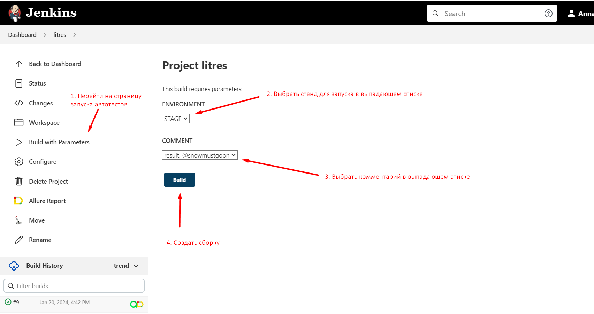
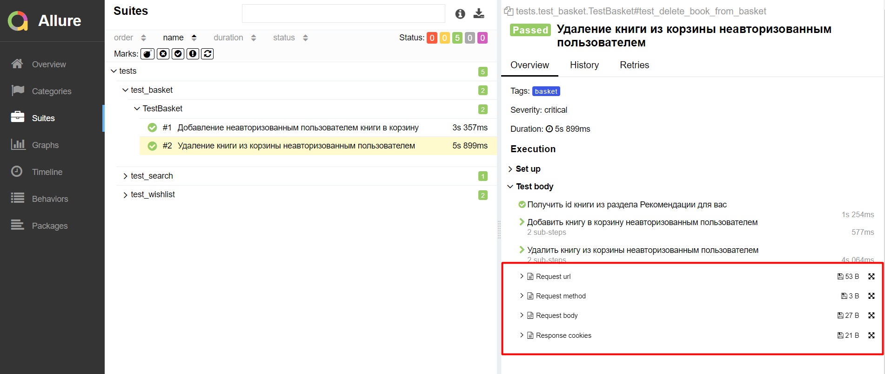

<h1> Проект по тестированию сайта Litres</h1>

> <a target="_blank" href="https://www.litres.ru/">Ссылка на сайт</a>

### Используемый стэк

       

----

### Проект в Jenkins
> <a target="_blank" href="https://github.com/Annatrg/litres">Ссылка на проект в Jenkins</a>

Наш проект возможно запускать через Jenkins. Доступны следующие параметры сборки:
* `environment` - параметр позволяет выбрать окружение, на котором будут запущены тесты
* `comment` - параметр позволяет выбрать комментарий из предложенных

#### Шаги для запуска автотестов через Jenkins

1. Открыть страницу <a target="_blank" href="https://github.com/Annatrg/litres">проекта</a>
2. В меню выбрать пункт `Build with Parameters`
3. Выбрать окружение в выпадающем списке
4. Выбрать комментарий
5. Нажать кнопку `Build`

После прохождения автотестов в Build History будет доступен отчет

----

### Allure отчет
#### Общие результаты

На странице с общими результатами мы можем увидеть общее количество тестов, сколько из них были успешными и сколько не успешными

#### Отчет прохождения теста

В отчете для каждого кейса доступны 4 приложения. Среди них URL запроса, метод, тело запроса и куки 

----

### Оповещения в Telegram

После выполнения автотестов, запущенных через Jenkins, также придёт уведомление в Telegram_bot об итогах тестирования

----
